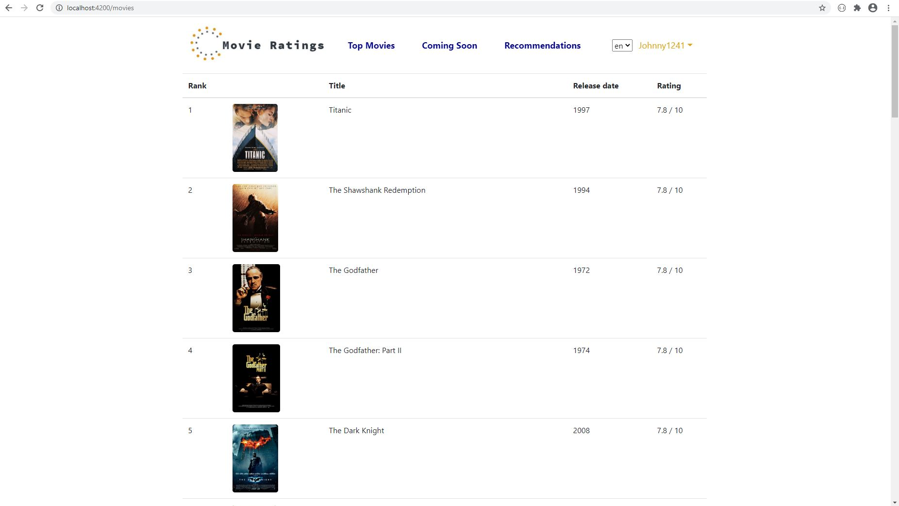
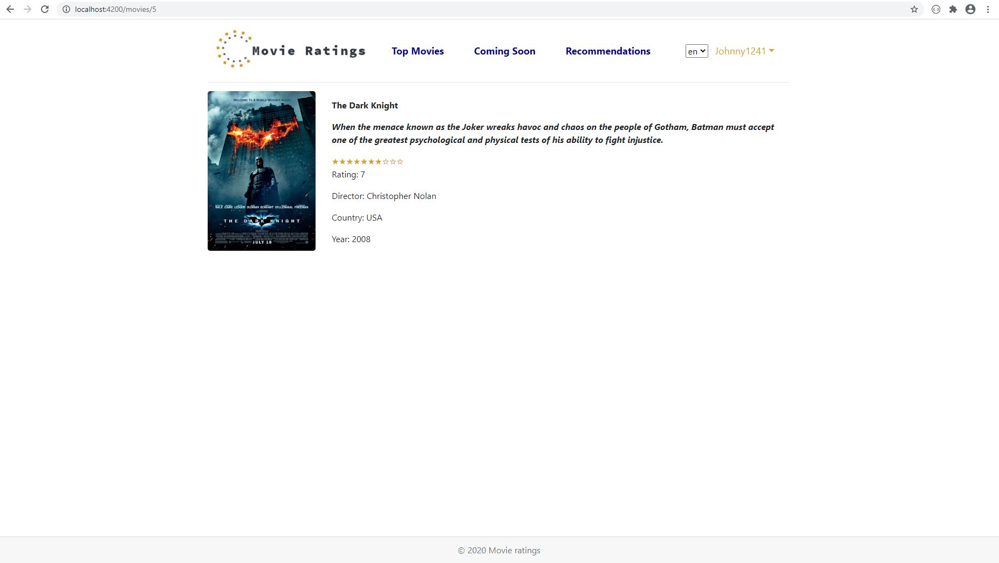

Movie Ratings [work in progress]
---------------------------------------------
Rate movies and get recommendations on what to watch next

---------------------------------------------
#### This project contains technologies:
- Java 11
- Spring Boot 2.2.2
- Angular 9
- Ngx-bootstrap 5.6.1
- Docker Compose 3.1
- JPA + Hibernate
- PostgreSQL 12
- Liquibase 3.8.5
- Maven 3.6.2

---------------------------------------------
##### Features:
- rate movies and keep track of what movies you have seen
- show the list of top movies
- show details of selected movie
- check coming soon movies
- show recommendations

###### To run the application you need to install: Java JDK 11, Node.js, Docker

---------------------------------------------
#### How to run application:
Backend:
```
 # 1. Run the script that starts the PostgreSQL database via Docker Compose 

cd docker/dependencies

 # Linux / MacOS
./start.sh

 # On Windows
start.sh

 # 2. Run class MovieRatingsBackendApplication
```

Frontend:
```
 # 1. Download all frontend dependencies by command

npm install

 # 2. Run frontend application 

npm start

 # 3. Navigate to http://localhost:4200/
```
---------------------------------------------
##### Screens:
List of top movies.


Details of selected movie.



